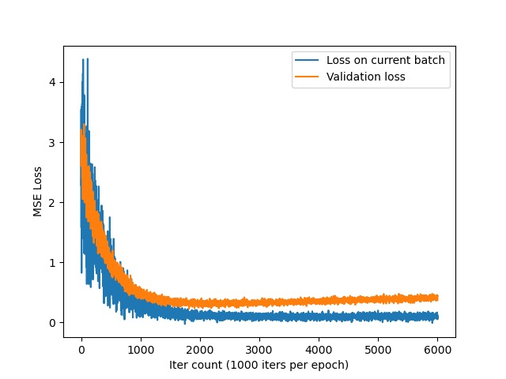

# Avancement du Projet Data Science

## What is this file ?
This file is a markdown file that track the advancement of the project. Since the project members communicate in French, 
the rest of the file is written in French.

## Avancements depuis la réunion du 04 Mars 2022:

### Augmentation de la base de données
Nous avons d’abord fini avec l’augmentation des données la dernière fois, donc on a pu trouver une méthode qui permet 
d’engendrer des images avec des rotations, contrastes, tailles et positions aléatoires. Nous avons engendré des images 
dont la variance est quatre fois la variance de l’image de base. Dans un premier temps, nous avons utilisé une variance 
constante pour le bruit, et nous comptons faire varier la variance du bruit pour augmenter la robustesse de notre modèle.

### Modèle U-Net
Pour le choix de notre framework, nous avons d’abord pensé à utiliser Keras car c’est un framework de haut niveau donc 
facile à prendre en main. Mais ensuite nous sommes passés à Pytorch pour plusieurs raisons. D’abord parce que c’est le 
framework le plus utilisé pour la recherche. Quand nous avons regardé les articles de recherche, environ 90% des 
articles utilisent PyTorch, et le reste avec TensorFlow. L’implémentation de certains modèles avec des poids 
pré-entraînés sont également plus facile à trouver en PyTorch qu’avec Keras.

Nous avons implémenté le modèle U-Net selon l’article à l’origine, mais traduit en PyTorch. Plusieurs raisons expliquent
le fait que nous n’avons pas pris une implémentation qui existe déjà sur GitHub. D’abord parce que nous voulions
comprendre davantage le modèle, car l’utilité de juste copier du code et faire l’entraînement est très faible. Une
deuxième raison est que, nous voulions pouvoir faire des ajustements sur le modèle, comme l’utilisation du « drop-out »
pour éviter le surentraînement (overfitting). 

### Sur les poids pré-entraînés
Nous avons d’abord voulu prendre des poids pré-entraînés, mais finalement nous avons décidé de ne pas les utiliser. 
La raison étant que la plupart des poids pré-entraînés sont adaptés à la segmentation, et les quelques poids 
pré-entraînés à peu près adaptés à notre problème sont pour des images à trois canaux. Pour les utiliser, il faut 
dupliquer nos images en niveau de gris (grayscale) en 3 canaux. Et on fait tripler le nombre de poids de notre modèle, 
ce qui est en contradiction avec l’intérêt principale de prendre des poids pré-entraînés qui est de réduire le temps
de l’entraînement.

### Dataset PyTorch
Nous avons créé notre objet dataset et dataloader, qui prends les images et les labels dans le bon format, les normalise
et les donne à notre modèle. Nous avons d’abord utilisé un dataset de 1000 images pour voir ce que notre algorithme 
donne. (Car les données prennent très vite beaucoup de place en mémoire disque), en 10 époques. 

### Entraînement du modèle

Nous remarquons que la fonction perte ne diminue quasiment plus au bout de 1-2 époques avec un rythme d’apprentissage
(learning rate) de 0,001. (Et augmente même un peu pour la fonction perte pour les données de validation) Nous avons
conclu qu’il y a en fait deux problèmes, le premier est que le rythme d’apprentissage n’est pas assez grand, et qu’il
y a un problème de surentraînement (overfitting).

### Online Training
Une des solutions possible au problème de surentraînement est l’augmentation de la taille de notre jeu de données
(dataset), ce qui prend beaucoup de place dans le disque dûr. Une base de donnée de 20000 images à 512x512 pixels
donnerait, par exemple, 26 giga-octets. Une autre solution serait d’utiliser un drop-out ou une 
régulation L2 pour diminuer la variance de notre modèle. 

En comparant le temps qu’il faut pour engendrer une image avec notre pipeline
d’augmentation de données, nous avons constaté que l’augmentation des données prend un temps négligeable devant
la vitesse d’entraînement du modèle. Nous avons donc implémenté un Dataset PyTorch qui engendre les données au moment
où nous les demandons lors de l’entraînement. (cf. la méthode get de la classe OnlineDataset) Cela fait que chaque
batch de données n’est utilisé qu’une fois pour l’entraînement. 

## Learning rate decay
Pour le problème de rythme d’apprentissage trop important, une approche serait évidemment de diminuer directement
le taux d’apprentissage manuellement à chaque fois que nous constatons un plateau de perte (loss plateau), c’est-à-dire
lorsque la fonction perte sur le jeu de données de validation se stabilise cesse de diminuer. Au lieu de le faire à la 
main et observer de temps en temps la courbe de perte, nous avons décidé de faire une approche plus automatisée. 

Nous avons utilisé un planificateur de rythme d’apprentissage (learning-rate scheduler) pour diminuer le taux
d’apprentissage au fur et à mesure que la perte se stabilise. 

## Évaluation du modèle
Pour pouvoir évaluer la qualité de notre dé-bruitage, nous avons utilisé comme métrique le PSNR (Peak Signal to Noise
Ratio). 

---
## Todo List

### Done:

- todo: implement BM3D(Evi) (Done 19 April)
  (Found implementation on GitHub)

- todo: implement program which, given two input images, give the PSNR of the denoising algorithm (Evi) (Done 21 April) (Found implementation on GitHub)

- todo: figure out how to make our model work on Google Colab without re-uploading the files every time (Evi) (Done 21 april) (Connect to Google Drive)

- todo: add validation set and print validation loss during training (Evi) (Done)

- todo: use learning-rate decay when there's a plateau of the loss (Done 23 April) (PyTorch has an implementation of an optimization scheduler called "ReduceLROnPlateau")

---
Try to do before the meeting on the 28th April:

todo: add implementation of LGPCA (Yassine, Adele)

todo: find and add implementations of other evaluation functions than PSNR (Jean)

todo: use traditional denoising function before feeding the model (mean / median of window of pixels, gaussian kernel) (Jean)

todo: try padding the input image (Evi)

todo: try to train the model with different std of the gaussian noise (Evi)

Next rdv with the professor: 28th of this week

---

Other things to do:

todo: try other models than just U-Net, find open implementations, modify them to fit our needs (single-channel grayscale image) and push to github repo:
(https://paperswithcode.com/sota/image-denoising-on-sidd)

todo: make the depth of the U-net a parameter that's adjustable

todo: use padding to avoid losing pixels on the border (Evi)

todo: add overlay of actual image scan instead of only white noise

