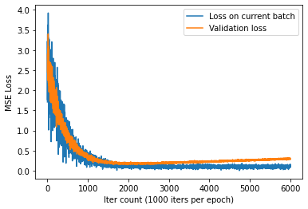

# Avancement du Projet Data Science

## What is this file ?
This file is a markdown file that track the advancement of the project. Since the project members communicate in French, 
the rest of the file is written in French.

## Avancements depuis la réunion du 04 Mars 2022:

### Augmentation de la base de données
Nous avons d’abord fini avec l’augmentation des données la dernière fois, donc on a pu trouver une méthode qui permet 
d’engendrer des images avec des rotations, contrastes, tailles et positions aléatoires. Nous avons engendré des images 
dont la variance est quatre fois la variance de l’image de base. Dans un premier temps, nous avons utilisé une variance 
constante pour le bruit, et puis dans un second temps changer la variance du bruit pour augmenter la robustesse de notre 
modèle.

### Modèle U-Net
Pour le choix de notre framework, nous avons d’abord pensé à utiliser Keras car c’est un framework de haut niveau donc 
facile à prendre en main. Mais ensuite nous sommes passés à Pytorch pour plusieurs raisons. D’abord parce que c’est le 
framework le plus utilisé pour la recherche. Quand nous avons regardé les articles de recherche, environ 90% des 
articles utilisent PyTorch, et le reste avec TensorFlow. L’implémentation de certains modèles avec des poids 
pré-entraînés sont également plus facile à trouver en PyTorch qu’avec Keras.

Nous avons implémenté le modèle U-Net selon l’article à l’origine, mais traduit en PyTorch. Plusieurs raisons expliquent
le fait que nous n’avons pas pris une implémentation qui existe déjà sur GitHub. D’abord parce que nous voulions
comprendre davantage le modèle, car l’utilité de juste copier du code et faire l’entraînement est très faible. Une
deuxième raison est que, nous voulions pouvoir faire des ajustements sur le modèle, comme l’utilisation du « drop-out »
pour éviter le surentraînement (overfitting). 

### Sur les poids pré-entraînés
Nous avons d’abord voulu prendre des poids pré-entraînés, mais finalement nous avons décidé de ne pas les utiliser. 
La raison étant que la plupart des poids pré-entraînés sont adaptés à la segmentation, et les quelques poids 
pré-entraînés à peu près adaptés à notre problème sont pour des images à trois canaux. Pour les utiliser, il faut 
dupliquer nos images en niveau de gris (grayscale) en 3 canaux. Et on fait tripler le nombre de poids de notre modèle, 
ce qui est en contradiction avec l’intérêt principale de prendre des poids pré-entraînés qui est de réduire le temps
de l’entraînement.

### Dataset PyTorch
Nous avons créé notre objet dataset et dataloader, qui prends les images et les labels dans le bon format, les normalise
et les donne à notre modèle. Nous avons d’abord utilisé un dataset de 1000 images pour voir ce que notre algorithme 
donne. (Car les données prennent très vite beaucoup de place en mémoire disque), en 10 époques. 

### Entraînement du modèle (Premier entraînement)

Nous remarquons que la fonction perte ne diminue quasiment plus au bout de 1-2 époques avec un rythme d’apprentissage
(learning rate) de 0,001. (Et augmente même un peu pour la fonction perte pour les données de validation) Nous avons
conclu qu’il y a en fait deux problèmes, le premier est que le rythme d’apprentissage n’est pas assez grand, et qu’il
y a un problème de surentraînement (overfitting).

## Les améliorations que nous avons fait avant de passer au deuxième entraînement. 

### Utilisation de Google Colab
Nous avons, pour le premier entraînement, utilisé nos machines locales (celui de Pinglei). Il s’avère que PyTorch ne
malgré le fait d’avoir un accélérateur graphique très performant, PyTorch utilis l’API cuda pour faire les entraînements
sur GPU, et cuda (développé par Nvidia) ne marche que sur les GPU de Nvidia. Et aucun d’entre nous n’a un ordinateur 
gaming assez puissant pour faire tourner nos modèles. Nous avons essayé d’entraîner notre modèle
sur le centre de donnée (data center) du campus de Metz, mais certaines limitations nous a poussé à adopter Google Colab
pour faire les entraînements (moins de limitation sur le temps, plus de RAM, etc.). Avec Colab nous avons pu entraîner
notre modèle avec un batch-size de 5 (au lieu de 1).

### Online Training
Une des solutions possible au problème de surentraînement est l’augmentation de la taille de notre jeu de données
(dataset), ce qui prend beaucoup de place dans le disque dûr. Une base de donnée de 20000 images à 512x512 pixels
donnerait, par exemple, 26 giga-octets. Une autre solution serait d’utiliser un drop-out ou une 
régulation L2 pour diminuer la variance de notre modèle. 

En comparant le temps qu’il faut pour engendrer une image avec notre pipeline
d’augmentation de données, nous avons constaté que l’augmentation des données prend un temps négligeable devant
la vitesse d’entraînement du modèle. Nous avons donc implémenté un Dataset PyTorch qui engendre les données au moment
où nous les demandons lors de l’entraînement. (cf. la méthode get de la classe OnlineDataset) Cela fait que chaque
batch de données n’est utilisé qu’une fois pour l’entraînement. 

## AdamW + OneCycleLR
Pour notre premier entraînement, la fonction perte sur le training set diminue de manière significative au début de 
l’entraînement, mais on rencontre des plateaux de perte vers la fin. Nous avons fait des recherches sur comment 
continuer à améliorer la performance de notre modèle lorsque la diminution de la perte devient très lente. Nous avons 
trouvé un article (https://arxiv.org/abs/1708.07120) qui explique qu’en utilisant un planificateur de rythme 
d’apprentissage (learning-rate scheduler) de type OneCycleLR, nous pouvons améliorer entraîner notre modèle plus 
rapidement en commençant avec un rythme d’apprentissage plus faible pour avoir une stabilisation du modèle, et en 
augmentant le rythme d’apprentissage pour avoir un entraînement plus rapide, puis diminue le rythme d’apprentissage pour
le paufinement des rythmes à la fin. Nous avons également essayé d’utiliser un scheduler de type CosineAnnealingLR, qui 
consiste à faire plusieurs cycles de rythme d’apprentissage (élevé, faible, élevé, faible…) pour éviter les problèmes de 
minimas locaux que peuvent induire les itérations avec un faible rythme d’apprentissage. 

## Rajout d’un paramètre de variance
Pour étudier la possibilité pour le modèle de s’adapter à plusieurs niveaux de variance du bruit gaussien, nous avons
rajouté à notre dataset un paramètre qui donne un intervalle de niveau de bruit. Les bruits qui sont engendrés sont
alors de variance aléatoire dans cet intervalle. Nous avons entraîné le modèle, et cela nous donne des pertes énormes
pour les nouvelles images au début de l’entraînement, car ce sont des niveaux de bruit que le modèle n’a jamais connu 
avant. Puis, il diminue pour atteindre le même niveau que ce que nous avons obtenu pour les données précédentes. 

## Deuxième entraînement.
Nous avons fait un entraînement ensuite sur 4000 itérations (avec un batch size de 5 images), avec l’optimiseur AdamW
(Un optimiseur de type AdamW est un optimiseur de type Adam qui utilise un weight decay, plus de détail dans le preprint
arxiv suivant : https://arxiv.org/abs/1711.05101) et un scheduler de type OneCycleLR.
Voici notre résultat en terme de perte : 

## Évaluation du modèle
Pour pouvoir comparer notre modèle aux méthodes de dé-bruitage classique de l’état de l’art, nou avons testé nos
images avec le BM3D, et nous avons enregistré les résultats : 

---
**Input**:

---

**Target**

---

**BM3D**

We implemented PSNR we haven't done it yet.

## Quelques resultats interessants:

Le modèle reconnaît le stente et ne fait pas juste un raisonnement locale. 

---

Essayez de trouver lequel est le target et lequel est l’output.

---

Un peu plus dûre…

---

Et lorsque le stent est très peu contrasté et avec une variance de bruit très fort : 

---
## Todo List

### Done:

- todo: implement BM3D and visualize the outputs (Pinglei) (Done 19 April)
  (Found implementation on GitHub)

- todo: implement program which, given two input images, give the PSNR of the denoising algorithm (Pinglei) (Done 21 April) (Found implementation on GitHub)

- todo: figure out how to make our model work on Google Colab without re-uploading the files every time (Pinglei) (Done 21 april) (Connect to Google Drive)

- todo: add validation set and print validation loss during training (Pinglei) (Done)

- todo: use learning-rate decay when there's a plateau of the loss (Pinglei) (Done 23 April) (PyTorch has an implementation of an optimization scheduler called "ReduceLROnPlateau")

- todo: find better learning rate schedulers (Pinglei) (Done 27 April) 
(Used OneCycleLR, CosineAneealingWarmRestarts)

---
Try to do before the meeting on the 28th April:

todo: add implementation of LPGPCA (Yassine, Kaiao)

todo: find and add implementations of other evaluation functions than PSNR (Jean) (Done)

todo: use traditional denoising function before feeding the model (mean / median of window of pixels, gaussian kernel) (Jean) (Done)

todo: try to train the model with different std of the gaussian noise (Pinglei) (Done 25 April)

Next rdv with the professor: 28th of this week

---

Other things to do:

todo: try other models than just U-Net, find open implementations, modify them to fit our needs (single-channel grayscale image) and push to github repo:
(https://paperswithcode.com/sota/image-denoising-on-sidd)

todo: make the depth of the U-net a parameter that's adjustable

todo: use padding to avoid losing pixels on the border (Pinglei)

todo: add overlay of actual image scan instead of only white noise

